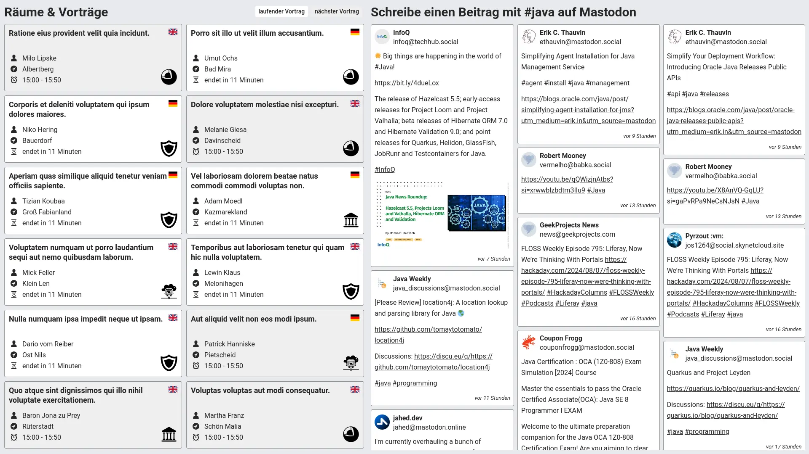
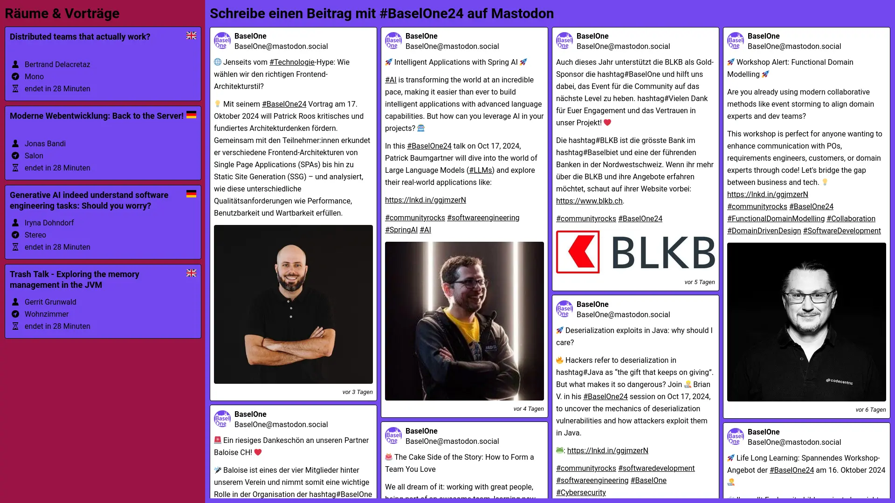
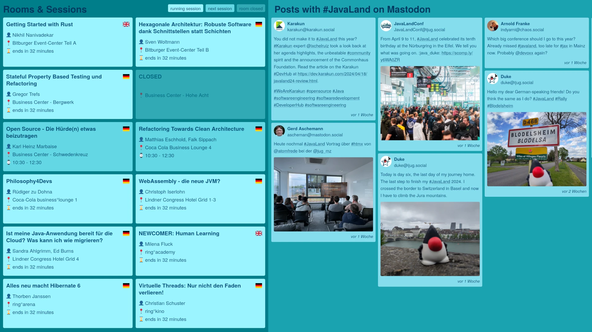
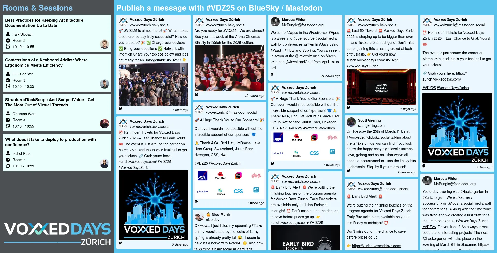

# Apus

[](https://github.com/McPringle/apus/actions/workflows/all-tests.yml)
[](https://codecov.io/gh/McPringle/apus)

## Contents

* [About](#about)
* [Mission Statement](#mission-statement)
* [Screenshots](#screenshots)
* [Features](#features)
* [Running in Production](#running-in-production)
  * [Using Docker](#using-docker)
  * [Using Podman](#using-podman)
* [Configuration](#configuration)
  * [Configuration Options](#configuration-options)
  * [Custom Styles](#custom-styles)
  * [Create Hashed Password](#create-hashed-password)
  * [Configuration Files](#configuration-files)
* [Contributing](#contributing)
  * [Good First Issues](#good-first-issues)
  * [Sign-off your commits](#sign-off-your-commits)
  * [Add an emoji to your commit](#add-an-emoji-to-your-commit)
  * [AI Generated Code](#ai-generated-code)
  * [Build](#build)
  * [Debugging](#debugging)
  * [Packaging](#packaging)
  * [Writing Plugins](#writing-plugins)
* [Communication](#communication)
* [Contributors](#contributors)
* [Copyright and License](#copyright-and-license)

## About

***Apus* is a social media wall for conferences.**

The name *Apus* is based on Apus Apus, Latin for common swift. This is a bird species that is extremely adapted to a life in the air and can stay in the air for around ten months almost without interruption and can reach speeds of more than 200 km/h during flight maneuvers. This bird breeds in a wall, flies reliably for extremely long periods without crashing and is also extremely fast. Hopefully all of this also applies to Apus: fast execution, uninterrupted and reliable operation!

See:

* https://en.wikipedia.org/wiki/Common_swift
* https://en.wikipedia.org/wiki/Apus_(bird)

## Mission Statement

🇬🇧  
*Apus* connects conference attendees in real time: Our application displays the up-to-date program with current and upcoming presentations as well as live-shared impressions from social networks. We provide orientation, foster interaction, and turn every event into a connected experience.

🇩🇪  
*Apus* bringt Konferenzteilnehmer in Echtzeit zusammen: Unsere Anwendung zeigt das aktuelle Programm mit laufenden und bevorstehenden Vorträge sowie live geteilte Eindrücke aus sozialen Netzwerken. So schaffen wir Orientierung, fördern Interaktion und machen jede Veranstaltung zu einem vernetzten Erlebnis.

## Screenshots

*Apus* supports localization. Screenshots are in different languages.


*Apus screenshot with default theme*


*Apus screenshot with BaselOne theme*


*Apus screenshot with Java Forum Stuttgart theme*


*Apus screenshot with JavaLand theme*


*Apus screenshot with Voxxed Days theme*

## Features

### Show posts from Social Media

| Platform    | Status    |
|-------------|-----------|
| BlueSky     | SUPPORTED |
| Mastodon    | SUPPORTED |

### Show event agenda

| Event                | Plugin                     |
|----------------------|----------------------------|
| BaselOne             | `SessionizePlugin`         |
| CloudLand            | `DoagPlugin`               |
| CyberLand            | `DoagPlugin`               |
| Devoxx               | `DevoxxPlugin`             |
| Java Forum Nord      | `SessionizePlugin`         |
| Java Forum Stuttgart | `JavaForumStuttgartPlugin` |
| JavaLand             | `DoagPlugin`               |
| KI Navigator         | `DoagPlugin`               |
| Voxxed Days          | `DevoxxPlugin`             |

### And more

| Feature                   | Status    |
|---------------------------|-----------|
| Running text with updates | - TODO -  |
| Show sponsor information  | SUPPORTED |
| Use event based styling   | SUPPORTED |

## Running in Production

It is highly recommended to use [Docker](https://www.docker.com/) or [Podman](https://podman.io/) to run *Apus* in production. Here follows a very short explanation of the example commands below. Consult the Docker or Podman documentation for more information about all available options for running an image.

| Option         | Explanation                                   |
|----------------|-----------------------------------------------|
| --name apus    | Specify the name for the running instance.    |
| -p 80:8080     | Make *Apus* available on host port 80         |
| -e KEY=value   | Configure *Apus* using environment variables. |
| -d             | Run *Apus* in daemon mode (background).       |
| --rm           | Remove the container when stopping *Apus*.    |
| mcpringle/apus | The Docker image to be started.               |

Modify the following commands according to your needs and consult the [configuration section](#configuration) below for more information about how to configure *Apus*. The Docker image of *Apus* will be pulled from [Docker Hub](https://hub.docker.com/) automatically when not available locally.

### Using Docker

```shell
docker run \
    --name apus \
    -p 80:8080 \
    -e APUS_SOCIAL_HASHTAGS=java \
    -e APUS_TIMEZONE=Europe/Zurich \
    -d \
    --rm \
    mcpringle/apus
```

### Using Podman

The parameters are the same like in in the Docker example, but the image must be prefixed with `docker.io/`:

```shell
podman run \
    --name apus \
    -p 80:8080 \
    -e APUS_SOCIAL_HASHTAGS=java \
    -e APUS_TIMEZONE=Europe/Zurich \
    -d \
    --rm \
    docker.io/mcpringle/apus
```

## Configuration

*Apus* can be started without any specific configuration. All configuration options have working default values.

### Configuration Options

To modify the default configuration values, just specify environment variables with the following names:

| Environment Variable            | Default       | Description                                                                           |
|---------------------------------|---------------|---------------------------------------------------------------------------------------|
| APUS_BLUESKY_HASHTAG_URL        | [1]           | The URL of the BlueSky API to get the posts containing a hashtag (empty = disabled).  |
| APUS_BLUESKY_INSTANCE           | api.bsky.app  | The BlueSky instance used to read the posts from (empty = disabled).                  |
| APUS_BLUESKY_MENTIONS_URL       | [2]           | The URL of the BlueSky API to get the posts mentioning a profile (empty = disabled).  |
| APUS_BLUESKY_POST_LIMIT         | 30            | The limit for the number of BlueSky posts when accessing the API.                     |
| APUS_BLUESKY_PROFILE            |               | The profile (without the @) of a BlueSky user to get the mentions (empty = disabled). |
| APUS_DEMO                       | false         | Enable (true) or disable (false) the demo mode to show demo data only.                |
| APUS_DEVOXX_EVENT_API           | [3]           | The URL of the Devoxx API to read the conference agenda.                              |
| APUS_DEVOXX_EVENT_ID            |               | The ID of the Devoxx event to read the conference agenda.                             |
| APUS_DEVOXX_WEEKDAY             |               | The day of the week of the Devoxx event to read the conference agenda.                |
| APUS_DOAG_EVENT_API             | [4]           | The URL of the DOAG event API to read the conference agenda.                          |
| APUS_DOAG_EVENT_ID              | 0             | The ID of the DOAG event to read the conference agenda (0 = disabled).                |
| APUS_EVENT_DATE_ADJUST          | P0D           | Adjust the date of the event, ISO-8601 formatted (P0D = disabled).                    |
| APUS_EVENT_IMAGE_URL            |               | The URL of the image to be shown below the event agenda (empty = no image).           |
| APUS_EVENT_NEXT_SESSION_TIMEOUT | 60            | Number of minutes a session is shown before it starts (0 = disabled).                 |
| APUS_EVENT_SHOW_EMPTY_ROOMS     | true          | Show (true) or hide (false) empty event rooms.                                        |
| APUS_EVENT_SHOW_LEGEND          | true          | Show (true) or hide (false) the event room legend.                                    |
| APUS_EVENT_TIME_ADJUST          | PT0D          | Adjust the time of the event, ISO-8601 formatted (PT0D = disabled).                   |
| APUS_EVENT_UPDATE_FREQUENCY     | 5             | How often (in minutes) to update event data (0 = disabled).                           |
| APUS_JFS_JSON_URL               |               | The URL of the JSON file for Java Forum Stuttgart.                                    |
| APUS_LANGUAGE                   | en            | Language code of the language used for the UI.                                        |
| APUS_MASTODON_ACCESS_TOKEN      |               | The Mastodon access token. Only needed for the notification API (see below).          |
| APUS_MASTODON_INSTANCE          | ijug.social   | The Mastodon instance used to read the posts from (empty = disabled).                 |
| APUS_MASTODON_LIMIT             | 30            | The limit for the number of results when accessing the Mastodon API.                  |
| APUS_MASTODON_NOTIFICATION_API  | [5]           | The URL of the Mastodon API to read the notifications (empty = disabled).             |
| APUS_MASTODON_POST_API          | [6]           | The URL of the Mastodon API to read the posts (empty = disabled).                     |
| APUS_PASSWORD                   |               | The hashed password to get admin access (empty = disabled).                           |
| APUS_SOCIAL_FILTER_LENGTH       | 500           | Hide social media posts which exceed this length (0 = disabled).                      |
| APUS_SOCIAL_FILTER_REPLIES      | true          | Hide social media posts which are replies.                                            |
| APUS_SOCIAL_FILTER_SENSITIVE    | true          | Hide social media posts which contain sensitive information.                          |
| APUS_SOCIAL_FILTER_WORDS        |               | Hide social media posts which contain these words.                                    |
| APUS_SOCIAL_COLUMNS             | 3             | How many columns to be used for social media posts.                                   |
| APUS_SOCIAL_HASHTAGS            |               | A list of comma separated hashtags for social media posts (empty = disabled).         |
| APUS_SOCIAL_HEADLINE            |               | Overwrite the headline for social media posts (empty = don't overwrite).              |
| APUS_SOCIAL_IMAGE_LIMIT         | 1             | Limit number of images per social media post (0 = no limit).                          |
| APUS_SOCIAL_IMAGES_ENABLED      | true          | Enable or disable images in social media posts.                                       |
| APUS_SESSIONIZE_EVENT_API       | [7]           | The URL of the Sessionize API to read the conference agenda.                          |
| APUS_SESSIONIZE_EVENT_ID        | 0             | The ID of the Sessionize event to read the conference agenda (0 = disabled).          |
| APUS_SESSIONIZE_SPEAKER_API     | [8]           | The URL of the Sessionize API to read the speaker information.                        |
| APUS_STYLES                     |               | Inject custom styles into the user interface (see explanations below).                |
| APUS_TIMEZONE                   | Europe/Zurich | The timezone used for date and time calculations.                                     |

The environment variables will override the default values. Some default values might be too long to be displayed in this table. They are marked with a number in square brackets and can be looked up in the following list:

1. `https://${instance}/xrpc/app.bsky.feed.searchPosts?q=%23${hashtag}&tag=${hashtag}&limit=${limit}`
2. `https://${instance}/xrpc/app.bsky.feed.searchPosts?q=%40${profile}&mentions=${profile}&limit=${limit}`
3. `https://${event}.cfp.dev/api/public/schedules/${weekday}`
4. `https://meine.doag.org/api/event/action.getCPEventAgenda/eventId.${event}`
5. `https://${instance\/api/v1/notifications?types[]=mention&limit=${limit}`
6. `https://${instance}/api/v1/timelines/tag/${hashtag}?limit=${limit}`
7. `https://sessionize.com/api/v2/${event}/view/Sessions`
8. `https://sessionize.com/api/v2/${event}/view/Speakers`

#### Adjusting Event Dates and Times

The `APUS_EVENT_DATE_ADJUST` option uses the ISO-8601 period formats `PnYnMnD` and `PnW`. Examples:

| Example     | Description                                                  |
|-------------|--------------------------------------------------------------|
| `P5D`       | +5 days                                                      |
| `P3M`       | +3 months                                                    |
| `P2Y`       | +2 years                                                     |
| `P4W`       | +4 weeks                                                     |
| `P1Y2M3D`   | +1 year, +2 months, +3 days                                  |
| `P1Y2M3W4D` | +1 year, +2 months, +25 days (3 weeks and 4 days)            |
| `P-1Y2M`    | -1 year, +2 months (minus is valid for the year only)        |
| `-P1Y2M`    | -1 year, -2 months (minus is valid for the whole expression) |

The `APUS_EVENT_TIME_ADJUST` option uses the ISO-8601 duration formats `PTnHnMnS`. Examples:

| Example    | Description                                                   |
|------------|---------------------------------------------------------------|
| `PT5H`     | +5 hours                                                      |
| `PT3M`     | +3 minutes                                                    |
| `PT2S`     | +2 seconds                                                    |
| `PT1H2M3S` | +1 hour, +2 minutes, +3 seconds                               |
| `PT-1H2M`  | -1 hour, +2 minutes (minus is valid for the hours only)       |
| `-PT1H2M`  | -1 hour, -2 minutes (minus is valid for the whole expression) |

#### Create Mastodon Access Token

1. Please log in at https://YOUR.INSTANCE/.
2. Open the page https://YOUR.INSTANCE/settings/applications/new.
3. Fill out the form:
   - Application name: Apus
   - Application website: https://APUS_DOMAIN/
   - Adjust the permissions as follows:
     - Enable only "read:notifications"
     - Disable everything else
4. Scroll to the bottom and click "Save".
5. The new application "Apus" will now appear in the table.
6. Click on the name "Apus".
7. Copy the access token (third line).

Replace the placeholder `YOUR.INSTANCE` with the domain of the Mastodon instance where your account is registered (e.g. `mastodon.social` or `ijug.social`) and replace `APUS_DOMAIN` with the domain where your Apus installation is accessible (e.g. `apus.ijug.eu`).

### Custom Styles

You can modify the styles of the user interface using CSS variables. The CSS variables must be set using the environment variable `APUS_STYLES` in key and value pairs. The key is the variable to be set and must start with two dashes (`--`). Keys and values must be separated by a colon (`:`). Multiple key and value pairs are separated by a semicolon (`;`). Example:

```
--name-of-variable-one:value1;--name-of-variable-two:value2
```

The following table contains the CSS variables you can modify to change the user interface and their default values:

| CSS Variable                      | Default           | Description                                                        |
|-----------------------------------|-------------------|--------------------------------------------------------------------|
| --event-background-color          | #e7eaee           | The color for the background of the event agenda.                  |
| --event-title-color               | #262626           | The color for the title of the event agenda.                       |
| --event-text-color                | #262626           | The color for the text of the event agenda.                        |
| --event-running-session-color     | #ffffff           | The color for the background of rooms with running sessions.       |
| --event-next-session-color        | #eeeeee           | The color for the background of rooms with sessions starting next. |
| --event-closed-room-color         | #cccccc           | The color for the background of closed rooms.                      |
| --event-room-border               | 1px solid #909090 | The border for the event room.                                     |
| --event-image-position-bottom     | 10px              | The position of the optional event image relative to the bottom.   |
| --event-image-position-left       | 10px              | The position of the optional event image relative to the left.     |
| --event-image-width               | auto              | The width of the optional event image.                             |
| --event-image-height              | auto              | The height of the optional event image.                            |
| --social-background-color         | #e7eaee           | The color for the background of the social wall.                   |
| --social-title-color              | #262626           | The color for the title of the social wall.                        |
| --social-text-color               | #262626           | The color for the text of the social wall.                         |
| --social-post-background-color    | #ffffff           | The color for the background of social posts.                      |
| --social-post-border              | 1px solid #909090 | The border for the social posts.                                   |
| --speaker-avatar-background-color | transparent       | The color for the background of speaker avatars.                   |
| --speaker-avatar-border           | none              | The border for the speaker avatars.                                |

> [!NOTE]  
> Default values may change in newer versions of *Apus*. Compare your custom styles before and after an update.

#### Example Styles

##### BaselOne

```
--event-background-color: #9a1445;
--event-title-color: #ffffff;
--event-text-color: #ffffff;
--event-running-session-color: #7248f0;
--event-next-session-color: #7248f0;
--event-closed-room-color: #7248f0;
--event-room-border: 1px solid #000000;
--event-image-border: 1px solid #000000;
--event-image-width: 250px;
--event-image-height: 250px;

--social-background-color: #7248f0;
--social-title-color: #ffffff;
--social-text-color: #000000;
--social-post-background-color: #ffffff;
--social-post-border: 1px solid #000000;

--speaker-avatar-background-color: transparent;
--speaker-avatar-border: none;
```

##### Java Forum Stuttgart

```
--event-background-color: #fcb913;
--event-title-color: #000000;
--event-text-color: #000000;
--event-running-session-color: #fff8dd;
--event-next-session-color: #fff8dd;
--event-closed-room-color: #fff8dd;
--event-room-border: 1px solid #000000;
--event-image-border: 1px solid #000000;
--event-image-width: 852px;

--social-background-color: #fff8dd;
--social-title-color: #000000;
--social-text-color: #000000;
--social-post-background-color: #ffffff;
--social-post-border: 1px solid #fcb913;
```

##### JavaLand

```
--event-background-color: #000000;
--event-title-color: #ffffff;
--event-text-color: #262626;
--event-running-session-color: #79fffe;
--event-next-session-color: #00f1ef;
--event-closed-room-color: #00c2c1;
--event-room-border: none;

--social-background-color: #272727;
--social-title-color: #ffffff;
--social-text-color: #262626;
--social-post-background-color: #ffa8a8;
--social-post-border: none;
```

##### Voxxed Days Zürich

```
--event-background-color: #4c4f53;
--event-title-color: #8ed1fc;
--event-text-color: #000000;
--event-running-session-color: #ebfffc;
--event-next-session-color: #ebfffc;
--event-closed-room-color: #ebfffc;
--event-room-border: none;
--event-image-position-bottom: 10px;
--event-image-position-left: 10px;
--event-image-width: 425px;

--social-background-color: #58c3f0;
--social-title-color: #ffffff;
--social-text-color: #000000;
--social-post-background-color: #ebf7ff;
--social-post-border: none;

--speaker-avatar-background-color: transparent;
--speaker-avatar-border: none;
```

### Create Hashed Password

For security reasons the password is not stored in cleartext. *Apus* requires the password to be hashed using [bcrypt](https://en.wikipedia.org/wiki/Bcrypt). Of course, *Apus* can do this for you. Start the JAR file providing the parameter `-p` followed by the password you want to create a hash for. The output will show you two lines of code. The first line contains the hashed password and the second line contains the same hashed password, but with the dollar signs escaped ready to copy and paste it into a `docker-compose.yaml`. Examples:

#### Using the Command Line

```
java -jar apus.jar -p 12345
Hashed password for environment variable: $2a$10$nybQbl/iY8SRJkfHJVncS.L5.OC3KJ6VRBYVAID7qnUqwylmn/BtK
Hashed password for Docker Compose file: $$2a$$10$$nybQbl/iY8SRJkfHJVncS.L5.OC3KJ6VRBYVAID7qnUqwylmn/BtK
```

#### Using Docker

```
docker run mcpringle/apus java -jar /usr/app/app.jar -p 12345
Hashed password for environment variable: $2a$10$nybQbl/iY8SRJkfHJVncS.L5.OC3KJ6VRBYVAID7qnUqwylmn/BtK
Hashed password for Docker Compose file: $$2a$$10$$nybQbl/iY8SRJkfHJVncS.L5.OC3KJ6VRBYVAID7qnUqwylmn/BtK
```

#### Using Podman

```
podman run docker.io/mcpringle/apus java -jar /usr/app/app.jar -p 12345
Hashed password for environment variable: $2a$10$nybQbl/iY8SRJkfHJVncS.L5.OC3KJ6VRBYVAID7qnUqwylmn/BtK
Hashed password for Docker Compose file: $$2a$$10$$nybQbl/iY8SRJkfHJVncS.L5.OC3KJ6VRBYVAID7qnUqwylmn/BtK
```

### Configuration Files

All configuration files are completely optional and stored in an `.apus` subdirectory of the home directory of the user running *Apus*.

| File              | Description                                           |
|-------------------|-------------------------------------------------------|
| `blockedProfiles` | This file contains blocked profiles, one per line.    |
| `hiddenPostIds`   | This file contains IDs of hidden posts, one per line. |

If you are running *Apus* in a Docker or Podman container and want to keep your configuration files between restarts, you can bind the `.apus` directory of the running container to an existing directory on your host system. Important: The directory on your host system must exist and must be writeable by the *Apus* user inside the container (which is user ID 1000 and group ID 1000). Consult the documentation of your host operating system if you need information about how to set the correct access rights.

Examples for binding the `.apus` directory of the running container to an existing directory on your host system using the `-v` option of Docker or Podman:

#### Using Docker

```shell
docker run \
    --name apus \
    -p 80:8080 \
    -v $HOME/mydir:/home/apus/.apus \
    -e APUS_SOCIAL_HASHTAGS=java \
    -e APUS_TIMEZONE=Europe/Zurich \
    -d \
    --rm \
    mcpringle/apus
```

#### Using Podman

```shell
podman run \
    --name apus \
    -p 80:8080 \
    -v $HOME/mydir:/home/apus/.apus \
    -e APUS_SOCIAL_HASHTAGS=java \
    -e APUS_TIMEZONE=Europe/Zurich \
    -d \
    --rm \
    docker.io/mcpringle/apus
```

## Contributing

### Good First Issues

To find possible tasks for your first contribution to *Apus*, we tagged some of the hopefully easier to solve issues as [good first issue](https://github.com/McPringle/apus/labels/good%20first%20issue).

If you prefer to meet people in real life to contribute to *Apus* together, we recommend to visit a [Hackergarten](https://www.hackergarten.net/) event. *Apus* is often selected as a contribution target in [Lucerne](https://www.meetup.com/hackergarten-luzern/), [Zurich](https://www.meetup.com/hackergarten-zurich/), and at the [JavaLand](https://www.javaland.eu/) conference.

Please join our developer community using our [Matrix chat](#matrix-chat) to get support and help for contributing to *Apus*.

### Sign-off your commits

It is important to sign-off *every* commit. That is a de facto standard way to ensure that *you* have the right to submit your content and that you agree to the [DCO](DCO.md) (Developer Certificate of Origin).

You can find more information about why this is important and how to do it easily in a very good [blog post](https://dev.to/janderssonse/git-signoff-and-signing-like-a-champ-41f3)  by Josef Andersson.

### Add an emoji to your commit

We love to add an emoji to the beginning of every commit message which relates to the nature of the change. You can find a searchable list of possible emojis and their meaning in the overview on the [gitmoji](https://gitmoji.dev/) website. If you prefer, you can also install one of the plugins that are available for almost all common IDEs.

### JSpecify, NullAway, and Error Prone

In this project we use [JSpecify](https://jspecify.dev/) together with [NullAway](https://github.com/uber/NullAway) and [Error Prone](https://errorprone.info/) to eliminate possible `NullPointerException`s. To make this work, each package must contain a `package-info.java` file with the following content:

```java
/**
 * LICENSE HEADER
 */
@NullMarked
package swiss.fihlon.apus.PACKAGE;

import org.jspecify.annotations.NullMarked;
```

Please use the same license header as in each other Java file. The annotation `@NullMarked` comes from [JSpecify](https://jspecify.dev/) and ensures that all reference types within a package are treated as `@NonNull` by default, unless they are explicitly annotated with `@Nullable`.

Please make extensive use of the `@Nullable` and `@NotNull` annotations in the while *Apus* code base. Annotate every method, method parameter, and return type with the appropriate annotation.As a result, every major IDE will warn you if you access something that can be `null` without checking it first. As additional protection, the [Error Prone Plugin](https://errorprone.info/) ensures that the build fails with a corresponding error.

This way, no more `NullPointerException`s should be thrown at runtime.

### AI Generated Code

AI generated source code is based on real existing source code, which is copied in whole or in part into the generated code. The license of the original source code with which the AI was trained is not taken into account. It is not clear which license conditions apply and how these can be complied with. For legal reasons, we therefore do not allow AI-generated source code at all.

### Build

*Apus* uses [Maven](https://maven.apache.org/) to build the project. Please use standard Maven commands to build what you need:

| Command          | What it does                                                      |
|------------------|-------------------------------------------------------------------|
| `./mvnw`         | compile and run the app                                           |
| `./mvnw clean`   | cleanup generated files and build artefacts                       |
| `./mvnw compile` | compile the code without running the tests                        |
| `./mvnw test`    | compile and run all tests                                         |
| `./mvnw package` | compile, test, and create a JAR file to run it with Java directly |
| `./mvnw verify`  | compile, test, package, and run analysis tools                    |

There is *no need* to run the `install` or `deploy` tasks. They will just run longer, produce unnecessary output, burn energy, and occupy your disk space. [Don't just blindly run mvn clean install...](https://www.andreaseisele.com/posts/mvn-clean-install/)

> [!NOTE]  
> *Apus* comes with a complete dockerized build for production use. It is **not** recommended to use the self-contained build for development purposes.

### Debugging

#### Command Line

To run from the command line, run `./mvnw` and open http://localhost:8080 in your browser.

#### Intellij IDEA

- Locate the `Application.java` class in the project view. It is in the `src` folder, under the main package's root.
- Right-click on the `Application` class
- Select "Debug 'Application.main()'" from the list

After the server has started, you can view the UI at http://localhost:8080/ in your browser.
You can now also attach breakpoints in code for debugging purposes, by clicking next to a line number in any source file.

#### Eclipse

- Locate the `Application.java` class in the package explorer. It is in `src/main/java`, under the main package.
- Right-click on the file and select `Debug As` --> `Java Application`.

Do not worry if the debugger breaks at a `SilentExitException`. This is a Spring Boot feature and happens on every startup.

After the server has started, you can view it at http://localhost:8080/ in your browser.
You can now also attach breakpoints in code for debugging purposes, by clicking next to a line number in any source file.

### Packaging

#### Maven

You can use [Maven](https://maven.apache.org/) to build *Apus* for production. Just specify the `production` profile. Example:

```shell
./mvnw clean package -Pproduction
```

Once completed successfully, you will find the artifact in the `target` directory. The file is named `apus-VERSION.jar`.

#### Docker

To create a production build for *Apus* it is highly recommended to use [Docker](https://www.docker.com/) or [Podman](https://podman.io/). *Apus* comes with a complete dockerized self-contained build. You don't need to have Maven or Java installed, [Docker](https://www.docker.com/) or [Podman](https://podman.io/) is enough. The Docker build file contains everything needed, just start a standard Docker build with the following command:

```shell
docker build -t apus .
```

This might run for a while and will produce a Docker image tagged `apus` on your local system.

### Writing Plugins

#### Event Plugins

*Apus* uses a simple plugin technology to import the agenda of various events. Plugins are currently available for the following events:

| Plugin                     | Supported Events                             |
|----------------------------|----------------------------------------------|
| `EventDemoPlugin`          | Creates fake session data for demo purposes. |
| `DevoxxPlugin`             | Devoxx and Voxxed Days conferences           |
| `DoagPlugin`               | CloudLand, CyberLand, JavaLand, KI Navigator |
| `JavaForumStuttgartPlugin` | Java Forum Stuttgart                         |
| `SessionizePlugin`         | BaselOne, Java Forum Nord                    |

#### Social Plugins

*Apus* uses a simple plugin technology to import posts from various social media services. Plugins are currently available for the following services:

| Plugin             | Supported Services                          |
|--------------------|---------------------------------------------|
| `BlueSkyPlugin`    | BlueSky Social                              |
| `MastodonPlugin`   | Mastodon                                    |
| `SocialDemoPlugin` | Creates fake social posts for demo purposes |

#### Plugin Development

Everyone is welcome to contribute a plugin themselves. The implementation is very simple. There are two types of plugins: `EventPlugin` and `SocialPlugin`. For a new plugin, a new package is created under `swiss.fihlon.apus.plugin.event` or `swiss.fihlon.apus.plugin.social`, based on the plugin type. The implementation is carried out in this new package. Implement one of these two interfaces depending on the plugin type you want to contribute and annotate the class with `@Service`.

If your implementation requires a configuration, implement the configuration as a `record` in your new plugin package. Take the configuration of one of the existing plugins as a template. Default settings belong in the file `application.properties` and the corresponding schema is stored in `additional-spring-configuration-metadata.json`. Finally, add the configuration class of your new plugin to the `AppConfig` class and modify this `README.md` accordingly.

## Communication

### Matrix Chat

There is a channel at Matrix for quick and easy communication. This is publicly accessible for everyone. For developers as well as users. The communication in this chat is to be regarded as short-lived and has no documentary character.

You can find our Matrix channel here: [@project-apus:ijug.eu](https://matrix.to/#/%23project-apus:ijug.eu)

### GitHub Discussions

We use the corresponding GitHub function for discussions. The discussions held here are long-lived and divided into categories for the sake of clarity. One important category, for example, is that for questions and answers.

Discussions on GitHub: https://github.com/McPringle/apus/discussions  
Questions and Answers: https://github.com/McPringle/apus/discussions/categories/q-a

## Contributors

Special thanks for all these wonderful people who had helped this project so far ([emoji key](https://allcontributors.org/docs/en/emoji-key)):

<!-- ALL-CONTRIBUTORS-LIST:START - Do not remove or modify this section -->
<!-- prettier-ignore-start -->
<!-- markdownlint-disable -->
<table>
  <tbody>
    <tr>
      <td align="center" valign="top" width="14.28%"><a href="https://github.com/McPringle"><br /><sub><b>Marcus Fihlon</b></sub></a><br /><a href="#projectManagement-McPringle" title="Project Management">📆</a> <a href="#ideas-McPringle" title="Ideas, Planning, & Feedback">🤔</a> <a href="https://github.com/McPringle/apus/commits?author=McPringle" title="Code">💻</a> <a href="#design-McPringle" title="Design">🎨</a></td>
      <td align="center" valign="top" width="14.28%"><a href="https://github.com/jcgueriaud1"><br /><sub><b>Jean-Christophe Gueriaud</b></sub></a><br /><a href="https://github.com/McPringle/apus/commits?author=jcgueriaud1" title="Code">💻</a></td>
      <td align="center" valign="top" width="14.28%"><a href="https://github.com/myyxl"><br /><sub><b>Marlon</b></sub></a><br /><a href="https://github.com/McPringle/apus/issues?q=author%3Amyyxl" title="Bug reports">🐛</a></td>
      <td align="center" valign="top" width="14.28%"><a href="https://github.com/tlangdun"><br /><sub><b>tlangdun</b></sub></a><br /><a href="#tool-tlangdun" title="Tools">🔧</a></td>
      <td align="center" valign="top" width="14.28%"><a href="https://github.com/MarkusBarthlen"><br /><sub><b>MarkusBarthlen</b></sub></a><br /><a href="#tool-MarkusBarthlen" title="Tools">🔧</a></td>
      <td align="center" valign="top" width="14.28%"><a href="https://github.com/eins78"><br /><sub><b>Max Albrecht</b></sub></a><br /><a href="#infra-eins78" title="Infrastructure (Hosting, Build-Tools, etc)">🚇</a> <a href="#tool-eins78" title="Tools">🔧</a> <a href="#design-eins78" title="Design">🎨</a></td>
      <td align="center" valign="top" width="14.28%"><a href="https://github.com/StefanMallia"><br /><sub><b>Stefan Mallia</b></sub></a><br /><a href="https://github.com/McPringle/apus/commits?author=StefanMallia" title="Code">💻</a></td>
    </tr>
    <tr>
      <td align="center" valign="top" width="14.28%"><a href="https://github.com/jzfrank"><br /><sub><b>jzfrank</b></sub></a><br /><a href="https://github.com/McPringle/apus/commits?author=jzfrank" title="Code">💻</a></td>
      <td align="center" valign="top" width="14.28%"><a href="https://github.com/Interactiondesigner"><br /><sub><b>Interactiondesigner</b></sub></a><br /><a href="#design-Interactiondesigner" title="Design">🎨</a></td>
      <td align="center" valign="top" width="14.28%"><a href="https://github.com/1tchy"><br /><sub><b>Itchy</b></sub></a><br /><a href="https://github.com/McPringle/apus/commits?author=1tchy" title="Code">💻</a> <a href="#design-1tchy" title="Design">🎨</a></td>
      <td align="center" valign="top" width="14.28%"><a href="https://github.com/lokalesnetzwerk"><br /><sub><b>Max</b></sub></a><br /><a href="#design-lokalesnetzwerk" title="Design">🎨</a></td>
      <td align="center" valign="top" width="14.28%"><a href="https://adrianperez.me/"><br /><sub><b>Adrian Perez</b></sub></a><br /><a href="#infra-adpe" title="Infrastructure (Hosting, Build-Tools, etc)">🚇</a></td>
      <td align="center" valign="top" width="14.28%"><a href="https://github.com/patlecat"><br /><sub><b>patlecat</b></sub></a><br /><a href="https://github.com/McPringle/apus/commits?author=patlecat" title="Code">💻</a></td>
      <td align="center" valign="top" width="14.28%"><a href="https://github.com/haladamateusz"><br /><sub><b>Mateusz Halada</b></sub></a><br /><a href="https://github.com/McPringle/apus/commits?author=haladamateusz" title="Code">💻</a></td>
    </tr>
    <tr>
      <td align="center" valign="top" width="14.28%"><a href="https://github.com/leem53"><br /><sub><b>Lennart</b></sub></a><br /><a href="https://github.com/McPringle/apus/commits?author=leem53" title="Code">💻</a></td>
      <td align="center" valign="top" width="14.28%"><a href="https://github.com/RomeoIndiaJulietUniform"><br /><sub><b>RIJU MONDAL</b></sub></a><br /><a href="#infra-RomeoIndiaJulietUniform" title="Infrastructure (Hosting, Build-Tools, etc)">🚇</a></td>
      <td align="center" valign="top" width="14.28%"><a href="https://github.com/ky0n"><br /><sub><b>Hendrik</b></sub></a><br /><a href="https://github.com/McPringle/apus/commits?author=ky0n" title="Code">💻</a></td>
      <td align="center" valign="top" width="14.28%"><a href="https://github.com/uzoltan"><br /><sub><b>Zoltán Umlauf</b></sub></a><br /><a href="https://github.com/McPringle/apus/commits?author=uzoltan" title="Code">💻</a></td>
      <td align="center" valign="top" width="14.28%"><a href="https://offline.ch/"><br /><sub><b>Tobias Kündig</b></sub></a><br /><a href="https://github.com/McPringle/apus/commits?author=tobias-kuendig" title="Code">💻</a></td>
      <td align="center" valign="top" width="14.28%"><a href="http://www.sandra-parsick.de/"><br /><sub><b>Sandra Parsick</b></sub></a><br /><a href="https://github.com/McPringle/apus/commits?author=sparsick" title="Code">💻</a></td>
      <td align="center" valign="top" width="14.28%"><a href="https://aschemann.net/"><br /><sub><b>Gerd Aschemann</b></sub></a><br /><a href="https://github.com/McPringle/apus/commits?author=ascheman" title="Code">💻</a></td>
    </tr>
    <tr>
      <td align="center" valign="top" width="14.28%"><a href="https://github.com/johthor"><br /><sub><b>Johannes Thorn</b></sub></a><br /><a href="https://github.com/McPringle/apus/commits?author=johthor" title="Code">💻</a></td>
    </tr>
  </tbody>
</table>

<!-- markdownlint-restore -->
<!-- prettier-ignore-end -->

<!-- ALL-CONTRIBUTORS-LIST:END -->

## Copyright and License

[AGPL License](https://www.gnu.org/licenses/agpl-3.0.de.html)

*Copyright (C) Marcus Fihlon and the individual contributors to **Apus**.*

This program is free software: you can redistribute it and/or modify it under the terms of the GNU Affero General Public License as published by the Free Software Foundation, either version 3 of the License, or (at your option) any later version.

This program is distributed in the hope that it will be useful, but WITHOUT ANY WARRANTY; without even the implied warranty of MERCHANTABILITY or FITNESS FOR A PARTICULAR PURPOSE. See the GNU Affero General Public License for more details.

You should have received a copy of the GNU Affero General Public License along with this program.  If not, see <http://www.gnu.org/licenses/>.
